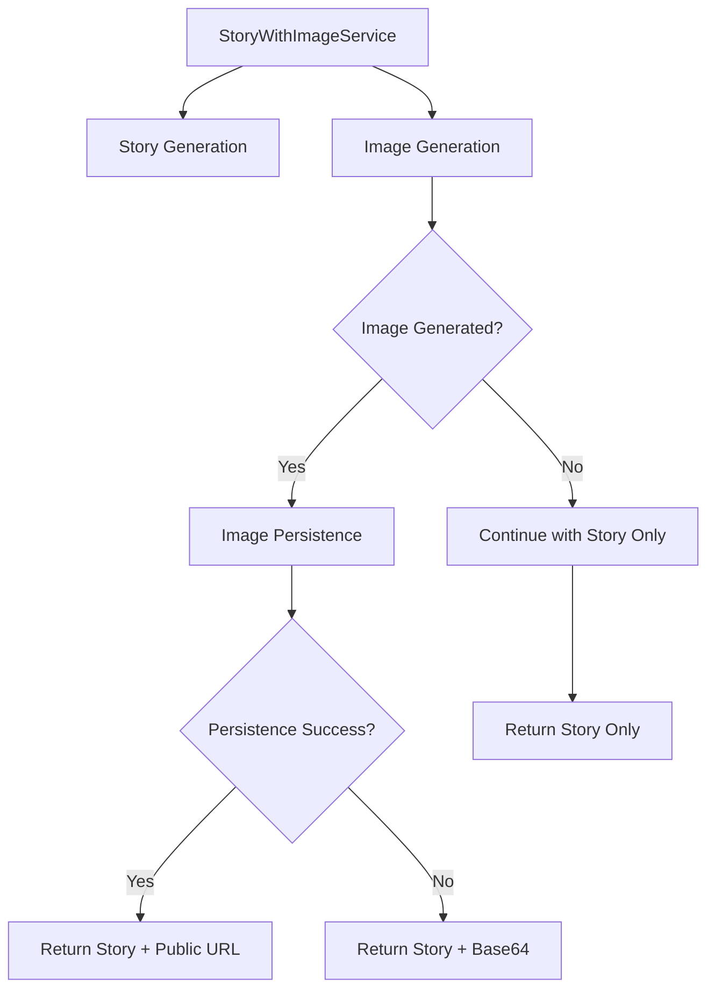

# 🖼️ Integración de Persistencia de Imágenes para Generación de Historias

> **Guía práctica para implementar persistencia de imágenes en producción con StoryWithImageService, incluyendo manejo de errores, degradación grácil y gestión de almacenamiento**

## 🎯 Problema que Resuelve

Como desarrollador trabajando con generación de historias mediante IA, necesitas implementar un sistema robusto de persistencia de imágenes que:

- Almacene automáticamente imágenes generadas en Supabase Storage
- Proporcione URLs públicas optimizadas para CDN caching
- Maneje errores gracilmente sin romper la funcionalidad de historias
- Ofrezca gestión de almacenamiento (cleanup, estadísticas, metadatos)
- Permita alternar entre modo memoria y persistencia según necesidades

## 💡 Solución: Sistema de Persistencia de Producción

### **Arquitectura de Aislamiento de Errores**



## 📋 Prerrequisitos

- [x] OpenRouter integration configurada (generación de historias)
- [x] Supabase Storage configurado con bucket `story-images`
- [x] Migración de base de datos ejecutada (campos image_*)
- [x] Comprensión de patrones de Service Composition

## 🔧 Implementación Paso a Paso

### **1. Configuración del Sistema de Persistencia**

#### **Instanciación del Servicio Completo**

```typescript
// src/services/story/StoryServiceFactory.ts
import { StoryWithImageService } from '@/services/openrouter/StoryWithImageService'
import { StoryGenerator } from '@/services/openrouter/StoryGenerator'
import { ImageGenerator } from '@/services/openrouter/ImageGenerator'
import { ImageStorageService } from '@/services/supabase/ImageStorageService'

export function createStoryService(persistImages: boolean = true) {
  // Servicios core de generación
  const storyGenerator = new StoryGenerator()
  const imageGenerator = new ImageGenerator()
  
  // Servicio de persistencia (opcional)
  const imageStorageService = persistImages 
    ? new ImageStorageService() 
    : undefined
  
  // Servicio orchestrador con persistencia
  return new StoryWithImageService(
    storyGenerator,
    imageGenerator, 
    imageStorageService,
    persistImages // Flag de persistencia
  )
}
```

#### **Configuración en Aplicación Vue**

```typescript
// src/boot/services.ts (Quasar Boot File)
import { createStoryService } from '@/services/story/StoryServiceFactory'
import type { App } from 'vue'

export default ({ app }: { app: App }) => {
  // Determinar modo según entorno
  const isPersistenceEnabled = process.env.NODE_ENV === 'production' 
    || process.env.VITE_ENABLE_IMAGE_PERSISTENCE === 'true'
  
  // Crear servicio con configuración apropiada
  const storyService = createStoryService(isPersistenceEnabled)
  
  // Proveer globalmente
  app.provide('storyService', storyService)
}
```

### **2. Uso Básico con Persistencia Automática**

#### **Generación de Historia con Imagen Persistida**

```typescript
// src/composables/useStoryGeneration.ts
import { ref, inject } from 'vue'
import type { StoryWithImageService } from '@/services/openrouter/StoryWithImageService'
import type { StoryWithImageRequest, StoryWithImageResponse } from '@/types/openrouter'

export function useStoryGeneration() {
  const storyService = inject<StoryWithImageService>('storyService')!
  
  const loading = ref(false)
  const error = ref<string | null>(null)
  const result = ref<StoryWithImageResponse | null>(null)

  const generateStoryWithImage = async (request: StoryWithImageRequest) => {
    loading.value = true
    error.value = null
    
    try {
      // El servicio maneja automáticamente:
      // 1. Generación de historia
      // 2. Generación de imagen (si includeImage = true)
      // 3. Persistencia en Supabase Storage 
      // 4. Fallback a base64 si persistencia falla
      // 5. Metadatos de almacenamiento
      result.value = await storyService.generateStoryWithImage(request)
      
      // Verificar si la imagen fue persistida exitosamente
      if (result.value.metadata.imagePersisted) {
        console.log('✅ Image persisted at:', result.value.image?.storage?.publicUrl)
        console.log('📊 Storage provider:', result.value.metadata.storageProvider)
      } else {
        console.log('⚠️ Image not persisted, using fallback')
      }
      
      return result.value
      
    } catch (err) {
      error.value = err instanceof Error ? err.message : 'Story generation failed'
      throw err
    } finally {
      loading.value = false
    }
  }

  return {
    loading: readonly(loading),
    error: readonly(error), 
    result: readonly(result),
    generateStoryWithImage
  }
}
```

#### **Ejemplo de Uso en Componente Vue**

```vue
<!-- src/components/story/StoryGenerationPanel.vue -->
<template>
  <div class="story-generation-panel">
    <div class="generation-form q-pa-md">
      <!-- Formulario de parámetros -->
      <q-form @submit.prevent="handleGenerate" class="q-gutter-md">
        <q-select
          v-model="request.level"
          :options="['A1', 'A2', 'B1', 'B2', 'C1', 'C2']"
          label="CEFR Level"
          outlined
        />
        
        <q-select
          v-model="request.genre" 
          :options="['adventure', 'mystery', 'romance', 'sci-fi']"
          label="Story Genre"
          outlined
        />
        
        <q-input
          v-model.number="request.wordCount"
          label="Word Count"
          type="number"
          outlined
          :rules="[val => val > 0 && val <= 500]"
        />
        
        <q-toggle
          v-model="request.includeImage"
          label="Generate Image"
          color="primary"
        />
        
        <q-select
          v-if="request.includeImage"
          v-model="request.imageStyle"
          :options="['educational', 'artistic', 'realistic']"
          label="Image Style"
          outlined
        />
        
        <q-btn
          type="submit"
          color="primary"
          size="lg"
          :loading="loading"
          :disable="!isFormValid"
          class="full-width"
        >
          <q-icon name="auto_stories" class="q-mr-sm" />
          Generate Story
        </q-btn>
      </q-form>
    </div>

    <!-- Resultado -->
    <div v-if="result" class="story-result q-mt-lg">
      <!-- Historia generada -->
      <q-card class="story-card">
        <q-card-section>
          <div class="text-h5 q-mb-md">{{ result.story.story.title }}</div>
          <div class="story-content">{{ result.story.story.content }}</div>
          
          <!-- Metadatos de generación -->
          <div class="story-metadata q-mt-md text-caption text-grey">
            <q-chip size="sm" color="primary" text-color="white">
              {{ result.story.story.level }}
            </q-chip>
            <q-chip size="sm" color="secondary" text-color="white">
              {{ result.story.story.word_count }} words
            </q-chip>
            <q-chip size="sm" color="accent" text-color="white">
              {{ result.story.story.reading_time_minutes }}min read
            </q-chip>
          </div>
        </q-card-section>
      </q-card>

      <!-- Imagen generada (si existe) -->
      <q-card v-if="result.image" class="image-card q-mt-md">
        <q-card-section>
          <div class="text-h6 q-mb-md">Generated Image</div>
          
          <!-- Display de imagen -->
          <div class="image-container">
            <q-img
              :src="result.image.imageUrl"
              :alt="result.image.prompt"
              spinner-color="primary"
              class="story-image"
              style="max-width: 400px; border-radius: 8px;"
            >
              <template v-slot:error>
                <div class="absolute-full flex flex-center bg-grey-3 text-grey-7">
                  <q-icon name="broken_image" size="lg" />
                  <div class="q-ml-sm">Image failed to load</div>
                </div>
              </template>
            </q-img>
          </div>
          
          <!-- Información de persistencia -->
          <div class="image-metadata q-mt-md">
            <div class="row q-gutter-xs">
              <q-chip
                :icon="result.metadata.imagePersisted ? 'cloud_done' : 'storage'"
                :color="result.metadata.imagePersisted ? 'positive' : 'warning'"
                text-color="white"
                size="sm"
              >
                {{ result.metadata.imagePersisted ? 'Persisted' : 'In Memory' }}
              </q-chip>
              
              <q-chip
                icon="dns"
                color="info"
                text-color="white" 
                size="sm"
              >
                {{ result.metadata.storageProvider }}
              </q-chip>
              
              <q-chip
                v-if="result.image.storage?.persistedAt"
                icon="schedule"
                color="grey"
                text-color="white"
                size="sm"
              >
                {{ formatDate(result.image.storage.persistedAt) }}
              </q-chip>
            </div>
            
            <!-- Información técnica (colapsible) -->
            <q-expansion-item
              label="Technical Details"
              icon="info"
              class="q-mt-sm"
            >
              <q-card flat bordered class="q-pa-sm bg-grey-1">
                <div class="text-caption">
                  <div><strong>Model:</strong> {{ result.image.model }}</div>
                  <div><strong>Prompt:</strong> {{ result.image.prompt }}</div>
                  <div v-if="result.image.storage?.storagePath">
                    <strong>Storage Path:</strong> {{ result.image.storage.storagePath }}
                  </div>
                  <div><strong>Placeholder:</strong> {{ result.image.isPlaceholder ? 'Yes' : 'No' }}</div>
                </div>
              </q-card>
            </q-expansion-item>
          </div>
        </q-card-section>
      </q-card>
    </div>

    <!-- Error state -->
    <q-banner
      v-if="error"
      class="bg-negative text-white q-mt-md"
      icon="error"
    >
      {{ error }}
      <template v-slot:action>
        <q-btn flat color="white" label="Retry" @click="handleGenerate" />
      </template>
    </q-banner>
  </div>
</template>

<script setup lang="ts">
import { ref, computed } from 'vue'
import { useStoryGeneration } from '@/composables/useStoryGeneration'
import type { StoryWithImageRequest } from '@/types/openrouter'

// Composable
const { loading, error, result, generateStoryWithImage } = useStoryGeneration()

// Form state
const request = ref<StoryWithImageRequest>({
  level: 'B1',
  genre: 'adventure', 
  wordCount: 150,
  includeImage: true,
  imageStyle: 'educational'
})

// Computed
const isFormValid = computed(() => {
  return request.value.level && 
         request.value.genre && 
         request.value.wordCount > 0 &&
         request.value.wordCount <= 500
})

// Methods
const handleGenerate = async () => {
  try {
    await generateStoryWithImage(request.value)
  } catch (err) {
    console.error('Generation failed:', err)
  }
}

const formatDate = (dateString: string) => {
  return new Date(dateString).toLocaleDateString()
}
</script>
```

### **3. Gestión Avanzada de Almacenamiento**

#### **Monitoreo y Estadísticas**

```typescript
// src/composables/useImageStorage.ts
import { ref } from 'vue'
import type { StoryWithImageService } from '@/services/openrouter/StoryWithImageService'

export function useImageStorage(storyService: StoryWithImageService) {
  const stats = ref(null)
  const loading = ref(false)

  // Obtener estadísticas de almacenamiento
  const getStorageStats = async () => {
    loading.value = true
    try {
      const storageStats = await storyService.getStorageStats()
      stats.value = storageStats
      return storageStats
    } finally {
      loading.value = false  
    }
  }

  // Limpiar imágenes huérfanas
  const cleanupOrphaned = async () => {
    const deletedCount = await storyService.cleanupOrphanedImages()
    console.log(`🧹 Cleaned up ${deletedCount} orphaned images`)
    
    // Refrescar stats después de cleanup
    await getStorageStats()
    
    return deletedCount
  }

  // Obtener metadatos de imagen específica
  const getImageMetadata = async (storyId: string) => {
    return await storyService.getStoredImage(storyId)
  }

  // Eliminar imagen específica
  const deleteImage = async (storyId: string) => {
    const deleted = await storyService.deleteStoredImage(storyId)
    
    if (deleted) {
      // Refrescar stats
      await getStorageStats()
    }
    
    return deleted
  }

  return {
    stats: readonly(stats),
    loading: readonly(loading),
    getStorageStats,
    cleanupOrphaned, 
    getImageMetadata,
    deleteImage
  }
}
```

#### **Panel de Administración de Storage**

```vue
<!-- src/components/admin/StorageManagementPanel.vue -->
<template>
  <div class="storage-management-panel">
    <div class="panel-header q-mb-lg">
      <h4>Image Storage Management</h4>
      <div class="header-actions">
        <q-btn
          @click="refreshStats"
          icon="refresh"
          color="primary"
          flat
          :loading="loading"
        >
          Refresh
        </q-btn>
        
        <q-btn
          @click="performCleanup"
          icon="cleaning_services"
          color="warning"
          :loading="loading"
        >
          Cleanup Orphaned
        </q-btn>
      </div>
    </div>

    <!-- Estadísticas generales -->
    <div v-if="stats" class="stats-cards row q-gutter-md q-mb-lg">
      <q-card class="col">
        <q-card-section>
          <div class="text-h6">{{ stats.totalImages }}</div>
          <div class="text-subtitle2">Total Images</div>
        </q-card-section>
      </q-card>
      
      <q-card class="col">
        <q-card-section>
          <div class="text-h6">{{ formatBytes(stats.totalSizeBytes) }}</div>
          <div class="text-subtitle2">Storage Used</div>
        </q-card-section>
      </q-card>
      
      <q-card class="col">
        <q-card-section>
          <div class="text-h6">{{ stats.imagesWithStories }}</div>
          <div class="text-subtitle2">Active Images</div>
        </q-card-section>
      </q-card>
      
      <q-card class="col">
        <q-card-section>
          <div class="text-h6 text-warning">{{ stats.orphanedImages }}</div>
          <div class="text-subtitle2">Orphaned</div>
        </q-card-section>
      </q-card>
    </div>

    <!-- Configuración del servicio -->
    <q-card class="config-card q-mb-lg">
      <q-card-section>
        <div class="text-h6 q-mb-md">Service Configuration</div>
        
        <div class="config-info">
          <div class="row items-center q-gutter-md">
            <div class="col-auto">
              <q-chip 
                :icon="config.persistImages ? 'cloud' : 'storage'"
                :color="config.persistImages ? 'positive' : 'grey'"
                text-color="white"
              >
                {{ config.persistImages ? 'Persistence Enabled' : 'Memory Only' }}
              </q-chip>
            </div>
            
            <div class="col-auto">
              <q-chip icon="dns" color="info" text-color="white">
                Provider: {{ config.storageProvider }}
              </q-chip>
            </div>
            
            <div class="col-auto">
              <q-chip 
                :icon="config.hasStorageService ? 'check_circle' : 'cancel'"
                :color="config.hasStorageService ? 'positive' : 'negative'"
                text-color="white"
              >
                Storage Service: {{ config.hasStorageService ? 'Available' : 'Missing' }}
              </q-chip>
            </div>
          </div>
          
          <!-- Toggle persistencia (solo en desarrollo) -->
          <div v-if="isDevelopment" class="q-mt-md">
            <q-toggle
              :model-value="config.persistImages"
              @update:model-value="togglePersistence"
              label="Enable Persistence Mode"
              color="primary"
            />
            <div class="text-caption text-grey q-mt-xs">
              Toggle between memory and persistent storage (development only)
            </div>
          </div>
        </div>
      </q-card-section>
    </q-card>

    <!-- Health status del servicio -->
    <q-card class="health-card">
      <q-card-section>
        <div class="text-h6 q-mb-md">Service Health</div>
        
        <div v-if="health" class="health-status">
          <div class="row q-gutter-md">
            <div class="col">
              <q-linear-progress
                :value="getHealthScore(health.storyService.status)"
                :color="getHealthColor(health.storyService.status)"
                size="lg"
                class="q-mb-xs"
              />
              <div class="text-caption">Story Service: {{ health.storyService.status }}</div>
            </div>
            
            <div class="col">
              <q-linear-progress
                :value="getHealthScore(health.imageService.status)"
                :color="getHealthColor(health.imageService.status)"
                size="lg"
                class="q-mb-xs"
              />
              <div class="text-caption">Image Service: {{ health.imageService.status }}</div>
            </div>
            
            <div v-if="health.storageService" class="col">
              <q-linear-progress
                :value="getHealthScore(health.storageService.status)"
                :color="getHealthColor(health.storageService.status)"
                size="lg"
                class="q-mb-xs"
              />
              <div class="text-caption">Storage Service: {{ health.storageService.status }}</div>
            </div>
          </div>
          
          <div class="overall-health q-mt-md">
            <q-chip
              :icon="getHealthIcon(health.overall)"
              :color="getHealthColor(health.overall)"
              text-color="white"
              size="lg"
            >
              Overall Status: {{ health.overall }}
            </q-chip>
          </div>
        </div>
      </q-card-section>
    </q-card>
  </div>
</template>

<script setup lang="ts">
import { ref, inject, onMounted, computed } from 'vue'
import { useImageStorage } from '@/composables/useImageStorage'
import type { StoryWithImageService } from '@/services/openrouter/StoryWithImageService'

// Dependencies
const storyService = inject<StoryWithImageService>('storyService')!
const { stats, loading, getStorageStats, cleanupOrphaned } = useImageStorage(storyService)

// Component state
const config = ref(storyService.getConfiguration())
const health = ref(null)

// Environment check
const isDevelopment = computed(() => process.env.NODE_ENV === 'development')

// Methods
const refreshStats = async () => {
  await getStorageStats()
  await getServiceHealth()
}

const performCleanup = async () => {
  try {
    const deletedCount = await cleanupOrphaned()
    
    $q.notify({
      type: 'positive',
      message: `Cleaned up ${deletedCount} orphaned images`,
      icon: 'cleaning_services'
    })
    
  } catch (error) {
    $q.notify({
      type: 'negative',
      message: `Cleanup failed: ${error.message}`,
      icon: 'error'
    })
  }
}

const getServiceHealth = async () => {
  health.value = await storyService.getHealthStatus()
}

const togglePersistence = (enabled: boolean) => {
  storyService.setPersistenceMode(enabled)
  config.value = storyService.getConfiguration()
  
  $q.notify({
    type: 'info',
    message: `Persistence mode ${enabled ? 'enabled' : 'disabled'}`,
    icon: enabled ? 'cloud' : 'storage'
  })
}

// Helper functions
const formatBytes = (bytes: number) => {
  if (bytes === 0) return '0 Bytes'
  const k = 1024
  const sizes = ['Bytes', 'KB', 'MB', 'GB']
  const i = Math.floor(Math.log(bytes) / Math.log(k))
  return parseFloat((bytes / Math.pow(k, i)).toFixed(2)) + ' ' + sizes[i]
}

const getHealthScore = (status: string) => {
  switch (status) {
    case 'healthy': return 1
    case 'degraded': return 0.6
    case 'unhealthy': return 0.2
    default: return 0
  }
}

const getHealthColor = (status: string) => {
  switch (status) {
    case 'healthy': return 'positive'
    case 'degraded': return 'warning'
    case 'unhealthy': return 'negative'
    default: return 'grey'
  }
}

const getHealthIcon = (status: string) => {
  switch (status) {
    case 'healthy': return 'check_circle'
    case 'degraded': return 'warning'
    case 'unhealthy': return 'error'
    default: return 'help'
  }
}

// Lifecycle
onMounted(() => {
  refreshStats()
})
</script>
```

### **4. Configuraciones de Modo Desarrollo vs Producción**

#### **Variables de Entorno**

```env
# .env.development
VITE_ENABLE_IMAGE_PERSISTENCE=false
VITE_IMAGE_STORAGE_MODE=memory
VITE_DEBUG_STORAGE_OPERATIONS=true

# .env.production
VITE_ENABLE_IMAGE_PERSISTENCE=true
VITE_IMAGE_STORAGE_MODE=supabase
VITE_DEBUG_STORAGE_OPERATIONS=false
```

#### **Configuración Dinámica**

```typescript
// src/config/storage.ts
export const storageConfig = {
  // Persistencia habilitada en producción por defecto
  persistenceEnabled: process.env.NODE_ENV === 'production' 
    || process.env.VITE_ENABLE_IMAGE_PERSISTENCE === 'true',
  
  // Provider de storage
  storageProvider: process.env.VITE_IMAGE_STORAGE_MODE || 'supabase',
  
  // Debug mode
  debugMode: process.env.VITE_DEBUG_STORAGE_OPERATIONS === 'true',
  
  // Límites de archivo
  maxImageSize: 5 * 1024 * 1024, // 5MB
  allowedMimeTypes: ['image/png', 'image/jpeg', 'image/webp'],
  
  // Cache settings
  cacheControl: '31536000', // 1 año para assets estáticos
  publicUrlExpiry: 3600, // 1 hora para URLs firmadas
  
  // Cleanup settings
  cleanupSchedule: '0 2 * * *', // Diario a las 2 AM
  orphanedImageThreshold: 24 * 60 * 60 * 1000 // 24 horas
}
```

## 🧪 Testing de la Implementación

### **Test de Integración Completa**

```typescript
// test/integration/image-persistence.integration.test.ts
import { describe, it, expect, beforeEach, afterEach } from 'vitest'
import { StoryWithImageService } from '@/services/openrouter/StoryWithImageService'
import { createTestServices } from './helpers/test-services'

describe('Image Persistence Integration', () => {
  let storyService: StoryWithImageService
  let testStoryId: string

  beforeEach(async () => {
    const services = await createTestServices({ persistImages: true })
    storyService = services.storyWithImageService
  })

  afterEach(async () => {
    // Cleanup test images
    if (testStoryId) {
      await storyService.deleteStoredImage(testStoryId)
    }
  })

  it('should persist image successfully and return public URL', async () => {
    const request = {
      level: 'B1' as const,
      genre: 'adventure' as const, 
      wordCount: 100,
      includeImage: true,
      imageStyle: 'educational'
    }

    const result = await storyService.generateStoryWithImage(request)
    testStoryId = result.story.story.id!

    // Verificar que la historia fue generada
    expect(result.story.story.title).toBeDefined()
    expect(result.story.story.content).toBeDefined()

    // Verificar que la imagen fue generada y persistida
    expect(result.image).toBeDefined()
    expect(result.image!.imageUrl).toMatch(/^https:\/\/.*supabase.*\.co\//)
    expect(result.image!.storage).toBeDefined()
    expect(result.image!.storage!.publicUrl).toBeDefined()
    expect(result.image!.storage!.persistedAt).toBeDefined()

    // Verificar metadatos de persistencia
    expect(result.metadata.imagePersisted).toBe(true)
    expect(result.metadata.storageProvider).toBe('supabase')
  })

  it('should handle persistence failure gracefully', async () => {
    // Simular fallo de storage desconectando Supabase temporalmente
    const originalSupabase = storyService['imageStorageService']['supabase']
    storyService['imageStorageService']['supabase'] = null

    const request = {
      level: 'A2' as const,
      genre: 'mystery' as const,
      wordCount: 80,
      includeImage: true
    }

    const result = await storyService.generateStoryWithImage(request)

    // Historia debe generarse correctamente
    expect(result.story.story.title).toBeDefined()

    // Imagen debe usar fallback base64
    expect(result.image).toBeDefined()
    expect(result.image!.imageUrl).toMatch(/^data:image\//)
    expect(result.image!.storage).toBeUndefined()

    // Metadatos deben indicar fallo de persistencia
    expect(result.metadata.imagePersisted).toBe(false)
    expect(result.metadata.storageProvider).toBe('supabase')

    // Restaurar Supabase
    storyService['imageStorageService']['supabase'] = originalSupabase
  })

  it('should work in memory-only mode', async () => {
    // Crear servicio en modo memoria
    const memoryService = new StoryWithImageService(
      storyService['storyGenerator'],
      storyService['imageGenerator'],
      undefined, // No storage service
      false // persistImages = false
    )

    const request = {
      level: 'B2' as const,
      genre: 'sci-fi' as const,
      wordCount: 120,
      includeImage: true
    }

    const result = await memoryService.generateStoryWithImage(request)

    // Verificar resultado correcto
    expect(result.story.story.title).toBeDefined()
    expect(result.image).toBeDefined()
    expect(result.image!.imageUrl).toMatch(/^data:image\//)
    
    // No debe haber storage metadata
    expect(result.image!.storage).toBeUndefined()
    expect(result.metadata.imagePersisted).toBe(false)
    expect(result.metadata.storageProvider).toBe('memory')
  })
})
```

### **Test de Gestión de Storage**

```typescript
// test/integration/storage-management.integration.test.ts
import { describe, it, expect, beforeEach } from 'vitest'
import { StoryWithImageService } from '@/services/openrouter/StoryWithImageService'

describe('Storage Management', () => {
  let storyService: StoryWithImageService
  
  beforeEach(async () => {
    const services = await createTestServices({ persistImages: true })
    storyService = services.storyWithImageService
  })

  it('should provide accurate storage statistics', async () => {
    const stats = await storyService.getStorageStats()
    
    expect(stats).toHaveProperty('totalImages')
    expect(stats).toHaveProperty('totalSizeBytes')
    expect(stats).toHaveProperty('imagesWithStories') 
    expect(stats).toHaveProperty('orphanedImages')
    
    expect(typeof stats.totalImages).toBe('number')
    expect(typeof stats.totalSizeBytes).toBe('number')
  })

  it('should cleanup orphaned images', async () => {
    const initialStats = await storyService.getStorageStats()
    
    // Si hay imágenes huérfanas, limpiarlas
    if (initialStats.orphanedImages > 0) {
      const deletedCount = await storyService.cleanupOrphanedImages()
      
      expect(deletedCount).toBeGreaterThanOrEqual(0)
      
      // Verificar que las estadísticas se actualizaron
      const newStats = await storyService.getStorageStats()
      expect(newStats.orphanedImages).toBeLessThan(initialStats.orphanedImages)
    }
  })

  it('should toggle persistence modes correctly', () => {
    // Verificar configuración inicial
    const initialConfig = storyService.getConfiguration()
    expect(initialConfig.persistImages).toBe(true)
    
    // Cambiar a modo memoria
    storyService.setPersistenceMode(false)
    const memoryConfig = storyService.getConfiguration()
    expect(memoryConfig.persistImages).toBe(false)
    expect(memoryConfig.storageProvider).toBe('memory')
    
    // Cambiar de vuelta a persistencia
    storyService.setPersistenceMode(true)
    const persistentConfig = storyService.getConfiguration()
    expect(persistentConfig.persistImages).toBe(true)
    expect(persistentConfig.storageProvider).toBe('supabase')
  })
})
```

## ⚠️ Consideraciones de Producción y Troubleshooting

### **🔥 Problemas Críticos a Evitar**

#### **1. Fallos de Persistencia que Rompen Generación de Historias**

```typescript
// ❌ INCORRECTO: Dejar que errores de storage rompan la funcionalidad principal
async generateStoryWithImage(request: StoryWithImageRequest) {
  const story = await this.storyGenerator.generateStory(request)
  const image = await this.imageGenerator.generateStoryImage(request)
  
  // Esto puede fallar y romper toda la funcionalidad
  const persistedImage = await this.storageService.saveStoryImage(image)
  
  return { story, image: persistedImage }
}

// ✅ CORRECTO: Aislamiento de errores con fallback
async generateStoryWithImage(request: StoryWithImageRequest) {
  const story = await this.storyGenerator.generateStory(request)
  
  let finalImage = null
  let imagePersisted = false
  
  if (request.includeImage) {
    try {
      const image = await this.imageGenerator.generateStoryImage(request)
      
      // Intentar persistencia solo si está habilitada
      if (this.persistImages && this.imageStorageService && story.story.id) {
        try {
          const persistedData = await this.imageStorageService.saveStoryImage(/*...*/)
          finalImage = { ...image, ...persistedData }
          imagePersisted = true
          
        } catch (storageError) {
          // Fallback a imagen base64 original
          console.warn('Image persistence failed, using base64 fallback:', storageError)
          finalImage = image
        }
      } else {
        finalImage = image
      }
      
    } catch (imageError) {
      console.warn('Image generation failed, continuing with story only:', imageError)
      // Continuar sin imagen
    }
  }
  
  return {
    story,
    image: finalImage,
    metadata: { imagePersisted, storageProvider: this.persistImages ? 'supabase' : 'memory' }
  }
}
```

#### **2. Memory Leaks con Imágenes Base64 Grandes**

```typescript
// ❌ INCORRECTO: No liberar URLs de objeto
const handleImageUpload = (file: File) => {
  const imageUrl = URL.createObjectURL(file)
  setImagePreview(imageUrl)
  // URL del objeto nunca se libera -> memory leak
}

// ✅ CORRECTO: Cleanup apropiado de URLs de objeto
const handleImageUpload = (file: File) => {
  // Liberar URL anterior si existe
  if (previousImageUrl) {
    URL.revokeObjectURL(previousImageUrl)
  }
  
  const imageUrl = URL.createObjectURL(file)
  setImagePreview(imageUrl)
  setPreviousImageUrl(imageUrl)
}

// En cleanup/unmount
onBeforeUnmount(() => {
  if (previousImageUrl) {
    URL.revokeObjectURL(previousImageUrl)
  }
})
```

#### **3. Falta de Cleanup de Imágenes Huérfanas**

```typescript
// Implementar job de cleanup automático
// src/services/cleanup/ImageCleanupJob.ts
export class ImageCleanupJob {
  constructor(private storyService: StoryWithImageService) {}

  async scheduleCleanup() {
    // Ejecutar cleanup cada 24 horas
    setInterval(async () => {
      try {
        const deletedCount = await this.storyService.cleanupOrphanedImages()
        console.log(`🧹 Scheduled cleanup: removed ${deletedCount} orphaned images`)
      } catch (error) {
        console.error('Scheduled cleanup failed:', error)
      }
    }, 24 * 60 * 60 * 1000) // 24 horas
  }
}
```

### **🔧 Diagnóstico y Solución de Problemas**

#### **Herramientas de Debug**

```typescript
// src/utils/storage-debug.ts
export function enableStorageDebug() {
  if (process.env.VITE_DEBUG_STORAGE_OPERATIONS === 'true') {
    
    // Interceptar operaciones de storage
    const originalConsoleLog = console.log
    console.log = (...args) => {
      if (args[0]?.includes?.('storage') || args[0]?.includes?.('image')) {
        originalConsoleLog('🖼️ [STORAGE DEBUG]', ...args)
      } else {
        originalConsoleLog(...args)
      }
    }
    
    // Agregar listener para errores de storage
    window.addEventListener('unhandledrejection', (event) => {
      if (event.reason?.message?.includes('storage') || 
          event.reason?.message?.includes('upload')) {
        console.error('🚨 [STORAGE ERROR]', event.reason)
      }
    })
  }
}
```

#### **Health Check Endpoint**

```typescript
// src/api/health/storage.ts
export async function GET() {
  try {
    const storyService = createStoryService(true)
    const health = await storyService.getHealthStatus()
    const stats = await storyService.getStorageStats()
    
    return new Response(JSON.stringify({
      status: 'ok',
      timestamp: new Date().toISOString(),
      services: health,
      storage: {
        totalImages: stats.totalImages,
        totalSizeBytes: stats.totalSizeBytes,
        orphanedImages: stats.orphanedImages
      }
    }), {
      status: 200,
      headers: { 'Content-Type': 'application/json' }
    })
    
  } catch (error) {
    return new Response(JSON.stringify({
      status: 'error',
      error: error.message,
      timestamp: new Date().toISOString()
    }), {
      status: 500,
      headers: { 'Content-Type': 'application/json' }
    })
  }
}
```

## 🔗 Referencias y Documentación Relacionada

### **📚 Documentación del Proyecto**

- [**Storage Services Usage**](storage-services-usage.md) - Patrones generales de storage
- [**OpenRouter Integration**](../apis/openrouter-integration.md) - Generación de historias base
- [**Supabase Storage API**](../../reference/apis/storage-api.md) - Referencia técnica de APIs
- [**Testing Strategies**](../testing/integration-testing-patterns.md) - Patrones de testing para servicios

### **🔧 Configuraciones Técnicas**

- [**Supabase Configuration**](../../reference/configurations/supabase-config.md) - Setup de base de datos y storage
- [**Environment Variables**](../../reference/configurations/environment-variables.md) - Variables de entorno requeridas
- [**TypeScript Configuration**](../../reference/configurations/typescript-config.md) - Configuración de tipos strict

### **🧪 Testing y Validación**

- [**Service Integration Testing**](../testing/service-integration-testing.md) - Testing de servicios complejos
- [**Mock Strategies for Storage**](../testing/mock-storage-strategies.md) - Mocking de Supabase Storage
- [**Performance Testing Guidelines**](../testing/performance-testing.md) - Testing de rendimiento

### **📖 Decisiones Arquitectónicas**

- [**Error Isolation Strategy**](../../explanation/architecture-decisions/error-isolation-pattern.md) - Por qué aislamos errores de storage
- [**Storage Provider Decision**](../../explanation/architecture-decisions/storage-provider-choice.md) - Por qué elegimos Supabase Storage
- [**Persistence vs Memory Trade-offs**](../../explanation/technical-deep-dive/persistence-memory-analysis.md) - Análisis de trade-offs

---

**💡 Pro Tip**: El sistema de persistencia de imágenes está diseñado siguiendo el principio de **degradación grácil**. Siempre prioriza que la funcionalidad principal (generación de historias) funcione, incluso si la persistencia de imágenes falla. Esto garantiza una experiencia de usuario robusta en producción.