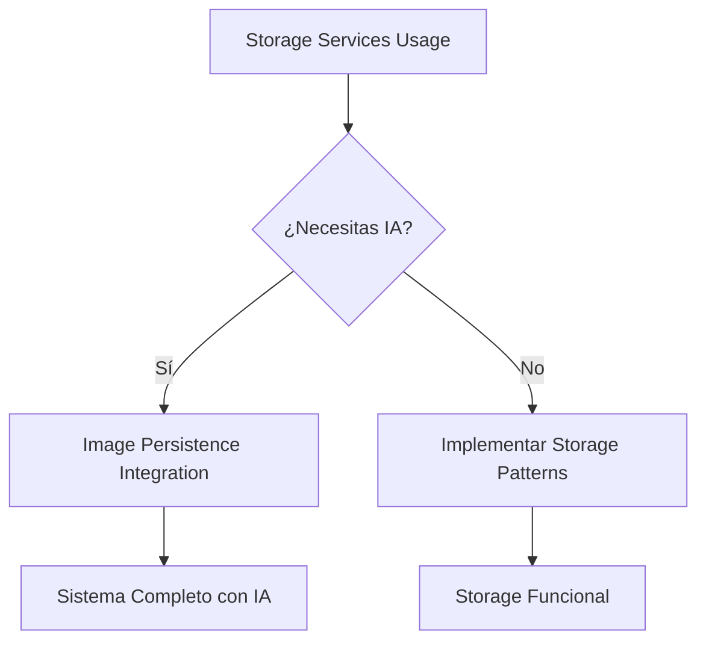

# 🛠️ Development Guides

Guías prácticas para implementar funcionalidades específicas de desarrollo en The Vaughan Storyteller.

## 📋 Guías Disponibles

### **Storage y Persistencia**

#### [🛠️ Uso de Servicios de Storage](storage-services-usage.md)
- **Qué cubre**: Patrones generales de storage (avatares, TTS, grabaciones, banners)
- **Para quién**: Desarrolladores implementando uploads y gestión de archivos
- **Prerrequisitos**: Vue 3, Quasar, composables básicos
- **Tiempo estimado**: 30-45 minutos

#### [🖼️ Integración de Persistencia de Imágenes](image-persistence-integration.md)
- **Qué cubre**: Sistema completo de persistencia para imágenes de historias generadas por IA
- **Para quién**: Desarrolladores implementando generación de historias con imágenes
- **Prerrequisitos**: OpenRouter integration, Supabase Storage, conceptos de error isolation
- **Tiempo estimado**: 45-60 minutos

## 🎯 Cuándo Usar Cada Guía

### **Usa Storage Services Usage cuando:**
- ✅ Necesitas implementar uploads de archivos del usuario
- ✅ Trabajas con audio TTS y sistema de cache
- ✅ Implementas gestión de banners para admin
- ✅ Requieres patterns drag & drop multi-archivo
- ✅ Buscas patrones generales de storage

### **Usa Image Persistence Integration cuando:**
- ✅ Implementas generación de historias con imágenes
- ✅ Necesitas persistencia automática en producción
- ✅ Requieres manejo robusto de errores y fallbacks
- ✅ Trabajas con orchestración de servicios complejos
- ✅ Implementas gestión de storage (cleanup, stats)

## 🔗 Flujo de Aprendizaje Recomendado

## 📚 Referencias Técnicas

- [Storage API Reference](../../reference/apis/storage-api.md)
- [Supabase Configuration](../../reference/configurations/supabase-config.md)
- [Testing Patterns](../testing/storage-testing-patterns.md)

---

**💡 Consejo**: Ambas guías siguen patrones de **degradación grácil** y **error isolation** para garantizar aplicaciones robustas en producción.